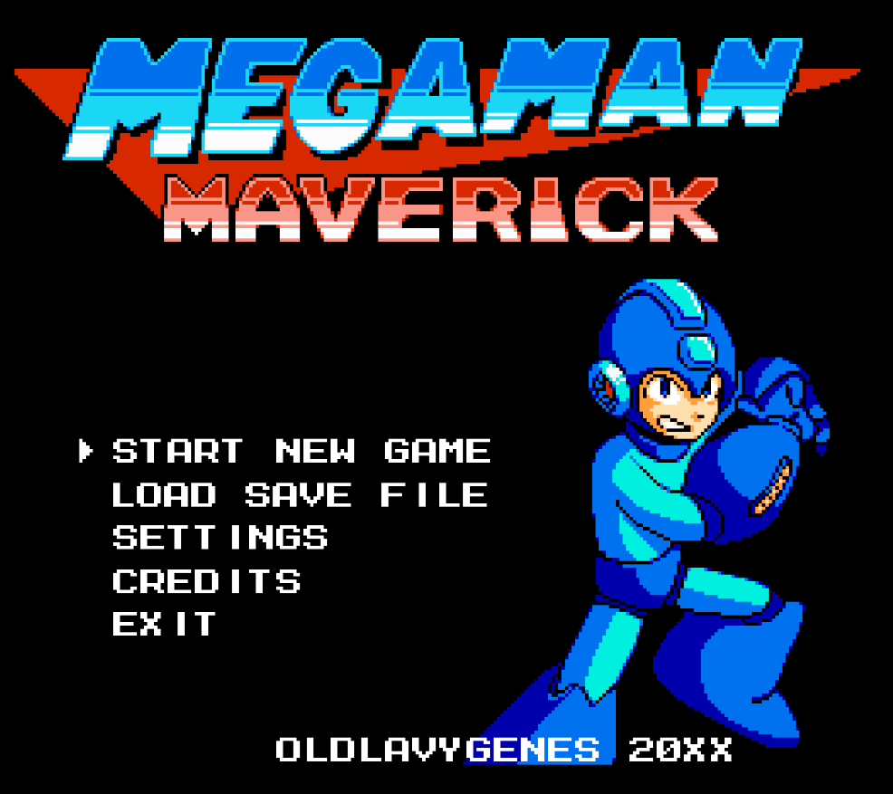
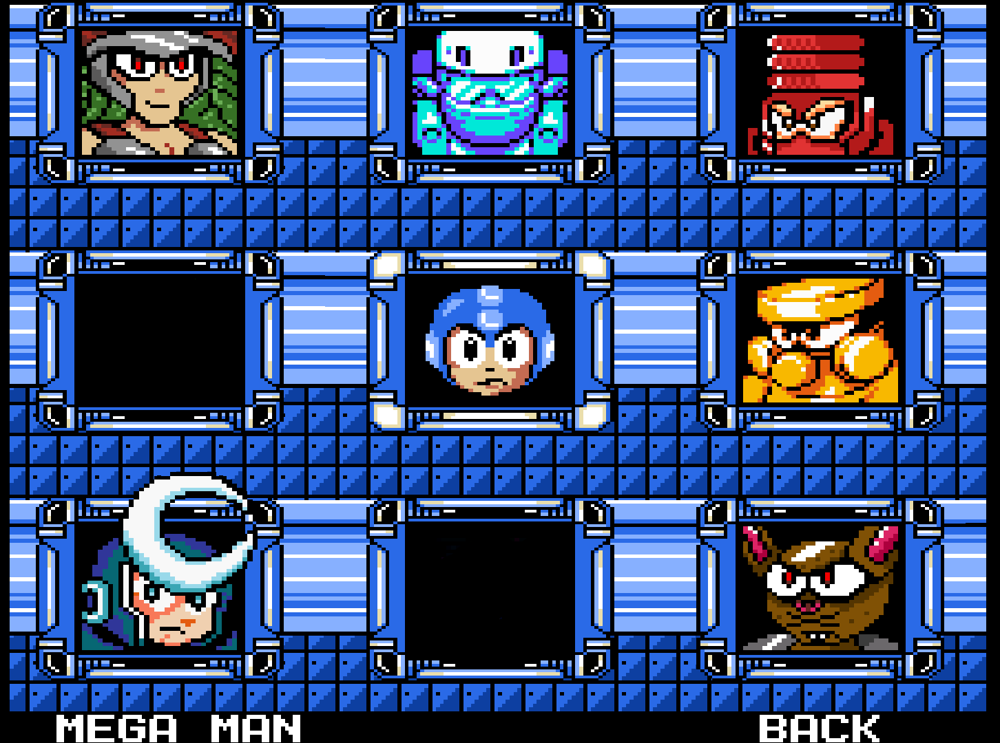
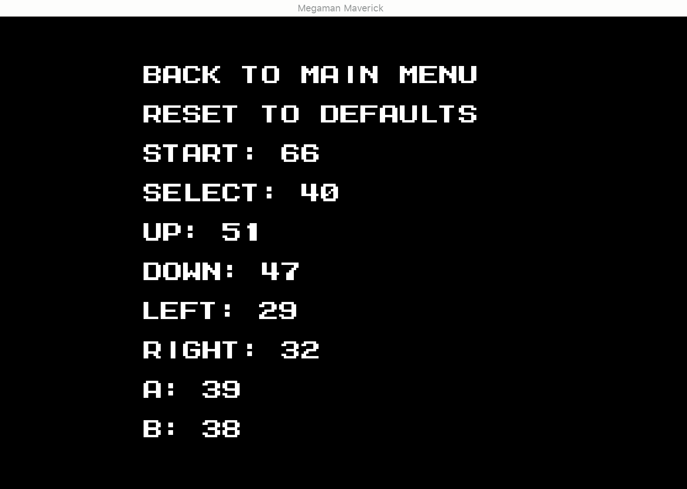
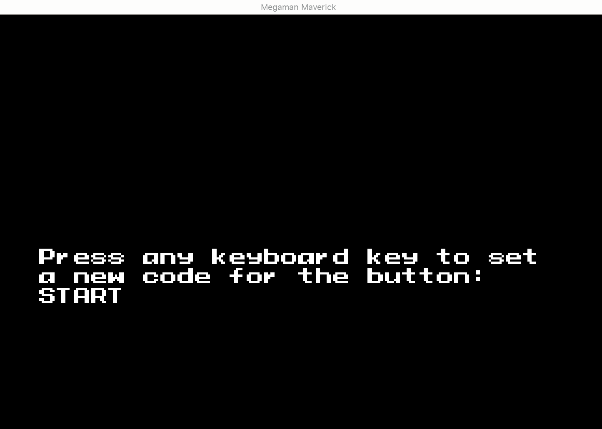
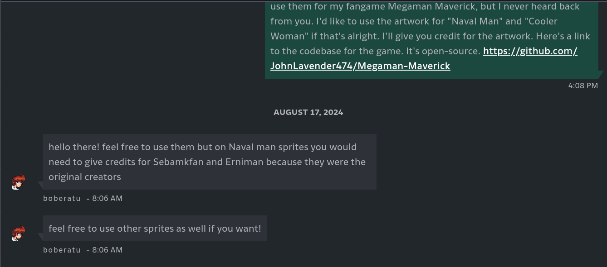
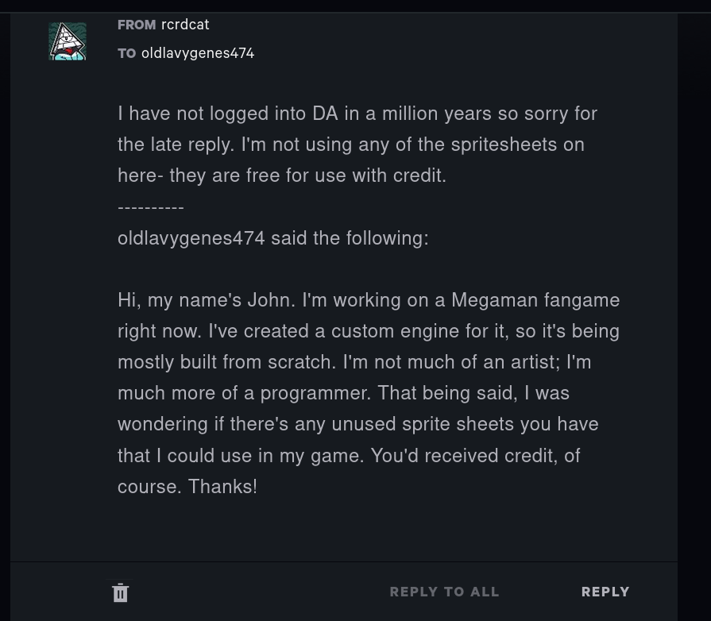
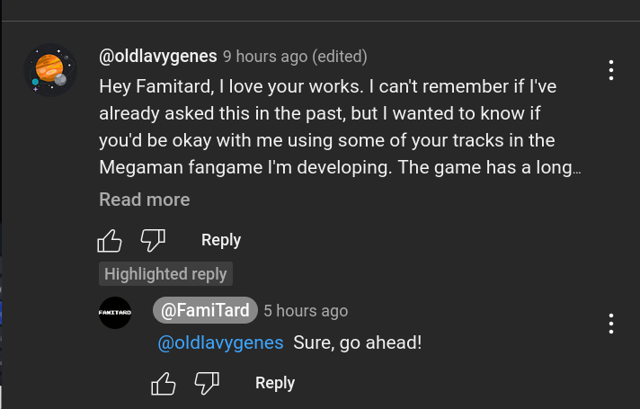

# MEGAMAN MAVERICK

---

Megaman Maverick is a non-commercial fan game based on the [classic Megaman series by Capcom](https://megaman.fandom.com/wiki/Mega_Man_(original_series)). 
All rights to "Megaman" are owned by Capcom, and this project aligns with their lenient stance on fan works.

Currently in pre-alpha, the game features assets from official Capcom titles and the community (see [Credits](#Credits)). 
Special thanks to these creators for helping make this dream project a reality!

- Framework: [LibGDX](https://libgdx.com/)
- Language: [Kotlin](https://kotlinlang.org/)

Check out my [YouTube channel](https://youtube.com/playlist?list=PL4ZszXL-HC0r0E6Eb5NCFGhsi93AXoDZj&si=IITydzhhTSKmxc5-) for demos!

Join the [Discord server](https://discord.gg/Cab2XMKs) for updates!




---

## RUNNING THE GAME

Currently, there is no "official" release of this game since it is still under active development. However, see the
section below on how to run the game using the source code.

### BUILDING THE GAME FROM SOURCE

Since the game runs using gradle and JRE, you can build a JAR of the game yourself. Keep in mind that in order to run
the generated JAR, you will need Java 17+ installed on your local machine.

#### Pre-requisites:

- Git
- Java 17+

##### Notes:
- Download Git using the following link: https://git-scm.com/downloads
- Download JDK 17+ (skip this step if running IntelliJ): https://www.oracle.com/java/technologies/javase/jdk17-archive-downloads.html
  - Set JDK Home on Windows: https://confluence.atlassian.com/doc/setting-the-java_home-variable-in-windows-8895.html
  - Set JDK Home on Mac: https://stackoverflow.com/questions/22842743/how-to-set-java-home-environment-variable-on-mac-os-x-10-9
  - Set JDK Home on Linux: https://access.redhat.com/solutions/1445833
  - If running Mac/Linux, run the following command to see if Java is properly installed and configured
    ```bash
    which java
    ```

1. Use `git` to clone the project to a suitable location on your desktop using the following command
   ```bash
   git clone https://github.com/JohnLavender474/Megaman-Maverick.git
   ```
2. From the root directory of the game project, run one of the following:
   1. Mac/Linux (edit the shell script to change settings):
      ```bash
      build-run-desktop-debug.sh
      ```
   2. Windows (will have to pass program args if you want to change any settings):
      ```bash
      ./gradlew lwjgl:run
      ```
- See the [GDX Liftoff](#GDX-Liftoff) section for more gradle commands and details.

---

## PLAYING THE GAME

### CONTROLS

By default, the keyboard controls for the game are the following whether the 1st value is the keyboard key and the 2nd
value is the "in-game" action:
- A: LEFT
- D: RIGHT
- S: DOWN
- W: UP
- J: B
- K: A
- ENTER: START

These can be remapped through the keyboard settings screen accessed from the main menu. Use the keys for "UP" and "DOWN"
(by default the "W" and "S" keys respectively) to navigate to the game button you wish to remap and press the key for
"START" (by default the "ENTER" key). You will be prompted to press any key on the keyboard to assign that key's code
to the in-game button action.




The game supports controllers and should detect a controller as soon as it is plugged in. The keyboard controls continue
to work even when a controller is connected. The game has been tested with the following controllers:
- PS3 controller
- Xbox 360 controller
- NES-style USB controller

When a controller is connected, default mappings are assigned. Most likely, you will want to configure these mappings.
In the "Controller Settings" screen, you can reassign the mappings for the controller similarly to how the same is done
for the keyboard mappings.

---

## THE STORY

The story is still in progress and nothing has been finalized yet.

---

## CREDITS

The artwork, sounds, and music used in this game are sourced from Capcom and fan works from the community. Below is a
comprehensive listing of the credits for the artwork used in this game.

### Pixel Art

#### Megaman

- Megaman Redesigned - [SamuelX4](https://www.deviantart.com/samuelx4) 

#### Title Screen

- Megaman Title Card - [SamuelX4](https://www.deviantart.com/samuelx4)
- Megaman Pose Sprite 
  - Original by [PixelBoy127](https://www.spriters-resource.com/custom_edited/megamancustoms/sheet/166239/)
  - Updated by [SamuelX4](https://www.deviantart.com/samuelx4)

#### Megaman

- Megaman complete spritesheet - [SamuelX4](https://www.deviantart.com/oldlavygenes474/art/1137567721)

#### Robot Masters

- Timber Woman spritesheet- [oldlavygenes](https://www.deviantart.com/oldlavygenes474/art/TimberWoman-Megaman-Maverick-1087794591)
- Rodent Man 
  - Original by [oldlavygenes](https://www.deviantart.com/oldlavygenes474/art/Rodent-Man-Megaman-Maverick-1087797101)
  - Updated by [SamuelX4](https://www.deviantart.com/oldlavygenes474/art/1137571452)
- Precious Man - [oldlavygenes](https://www.deviantart.com/oldlavygenes474/art/Precious-Man-Megaman-Maverick-1087800596)
- Timber Woman:
  - Original by [oldlavygenes](https://www.deviantart.com/oldlavygenes474/art/TimberWoman-Megaman-Maverick-1087794591)
  - Updated by [SamuelX4](https://www.deviantart.com/oldlavygenes474/art/Timber-Woman-Mugshot-1137568070)
- Moon Man spritesheet:
  - Original by [boberatu](https://www.deviantart.com/boberatu/art/MPN-006-Moon-Man-625679636)
  - Updated by [SamuelX4](https://www.deviantart.com/oldlavygenes474/art/1136876962)
- Inferno Man 
  - Original by [boberatu](https://www.deviantart.com/boberatu/art/MPN-000-Volcano-Man-313694441)
  - Updated by [SamuelX4](https://www.deviantart.com/oldlavygenes474/art/1137570993)
- Reactor Man - [Balloon Cart](https://balloon-cart.itch.io/reactor-man-asset-pack)
- Glacier Man - [Balloon Cart](https://balloon-cart.itch.io/glacier-man-asset-pack)
- Desert Man - [rcrdcat](https://www.deviantart.com/rcrdcat/art/Desert-Man-Spritesheet-Mugshot-332165249)

#### Other Bosses

- Moon Head - [oldlavygenes](https://www.deviantart.com/oldlavygenes474/art/MoonHead-Miniboss-Megaman-Maverick-1090151707)
- Nuclear Monkey - [Balloon Cart](https://balloon-cart.itch.io/reactor-man-asset-pack)
- Mecha Dragon - [Ansimuz](https://ansimuz.itch.io/mega-bot)
- Bospider - [Bean and Shawn](https://www.spriters-resource.com/game_boy_gbc/mmxtreme/sheet/480/?source=genre)
- Guts Tank - [Mister Mike](https://www.spriters-resource.com/nes/mm2/sheet/2317/)
- Penpen Maker - [Mister Mike](https://www.spriters-resource.com/nes/mm3/sheet/77911/) (currently not used)
- Sphinx - [Mister Mike](https://www.spriters-resource.com/custom_edited/megamancustoms/sheet/108177/) (currently not used)

### Dr. Wily

- Wily Mugshot - [Toni](https://www.spriters-resource.com/custom_edited/megamancustoms/sheet/161866/?source=genre)

#### Enemies

- [Samuel_X7](https://www.deviantart.com/samuelx4)
  - Astro (Ass) Assaulter
  - Staged Moon Landing Flag
  - Lumber Joe (original by MegaRed225)
  - Punk Fire Joe
  - Cactus
- [MegaRed225](https://www.deviantart.com/megared225/gallery):
  - [Random Enemies Set 1](https://www.deviantart.com/megared225/art/Random-Enemies-Set-1-517309440)
    - Toriko Plundge 
  - [Random Enemies Set 2](https://www.deviantart.com/megared225/art/Random-Enemies-Set-2-517311774)
    - Spike Copter
  - [Random Enemies Set 4](https://www.deviantart.com/megared225/art/Random-Enemies-Set-4-517313170)
    - Mettaur Demon
    - Mettaur Angel
  - [Random Enemies Set 5](https://www.deviantart.com/megared225/art/Random-Enemies-Set-5-517418497)
    - Lumber Joe (updated by SamuelX4)
    - Big Fish Neo
    - Cannon Hopper
    - Telly Saucer
  - [Random Enemies Set 7](https://www.deviantart.com/megared225/art/Random-Enemies-Set-7-539684729)
    - Iceskate Peng
    - Duo-Ball Cannon
  - [Random Enemies Set 9](https://www.deviantart.com/megared225/art/Random-Enemy-Sprites-Set-9-557171615):
    - Fire Dispensenator
  - [Random Enemies Set 10](https://www.deviantart.com/megared225/art/Random-Enemy-Sprites-Set-10-571128501)
    - Nutt Glider
- Mister Mike
  - [Sniper Joe Expanded](https://www.spriters-resource.com/custom_edited/megamancustoms/sheet/159822/)
- All other enemy sprites made by Capcom and sourced from https://www.spriters-resource.com/

### Blocks / Platforms

- [Samuel_X7](https://www.deviantart.com/samuelx4):
  - Robot Master Entry Gate
  - Rocket Platform (Jeff Bezos' Little Dick Rocket)

#### Tilesets

- [Balloon Cart](https://balloon-cart.itch.io)
  - [Reactor Man tileset](https://balloon-cart.itch.io/reactor-man-asset-pack)
  - [Glacier Man tileset](https://balloon-cart.itch.io/glacier-man-asset-pack)
- [Ansimuz](https://ansimuz.itch.io)
  - [Rodent Man tileset](https://ansimuz.itch.io/mega-bot)
  - [Inferno Man tileset (commissioned by oldlavygenes)](https://www.deviantart.com/oldlavygenes474/art/1142906425)
- [Super Icon Ltd](https://assetstore.unity.com/publishers/5990) 
  - [Mega 8-Bit Pixel Pack](https://assetstore.unity.com/packages/2d/environments/mega-8-bit-pixel-pack-60158)
- [Bongwater-bandit](https://www.deviantart.com/bongwater-bandit:
  - [MM6 Plant Man edit](https://www.deviantart.com/bongwater-bandit/art/MM6-Plant-Man-edit-875037908)
- Mister Mike
  - [Megaman 6 - Tomahawk Man Tileset](https://www.spriters-resource.com/nes/mm6/sheet/16402/)
  - [Megaman 3 - Wily Stage 1 Tileset](https://www.spriters-resource.com/nes/mm3/sheet/16388/)
- AxeW1eld3r
  - [Megaman 9 - Endless Attack Tileset](https://www.spriters-resource.com/wii/mm9/sheet/166545/)
  - [Megaman 10 - Endless Attack Tileset](https://www.spriters-resource.com/wii/mm10/sheet/166546/)
- Rabbid4240
  - [Megaman 9 - Magma Man Tileset](https://www.spriters-resource.com/wii/mm9/sheet/197901/)
- Megaman Maker
  - [Crystal Cave Background](https://wiki.megamanmaker.com/index.php/File:SprBGCrystal5_0.png)

### Music

- [Famitard](https://www.youtube.com/@FamiTard)
  - Main Menu - [MMX3 Intro Stage 8-Bit](https://youtu.be/jEPimSadiRE)
  - Intro Stage - [MMX2 Intro Stage 8-Bit](https://youtu.be/7omZK5SjNms)
  - Stage Select Menu - [MMX5 Stage Select 8-Bit](https://youtu.be/NooP1Ir2jp0)
  - Desert Man Stage - [MMX7 Vanishing Gungaroo 8-Bit](https://youtu.be/MFfZ-LEwcMo)
  - Moon Man Stage - [MMX5 Dark Necrobat 8-Bit](https://youtu.be/RosxPCxVOyk)
  - Glacier Man Stage - [MMX Chill Penguin 8-Bit](https://youtu.be/QWmsNV18S1g)
  - Reactor Man Stage - [MMX8 Burn Rooster 8-Bit](https://youtu.be/DHh-QSWvb-o)
  - Rodent Man Stage - [MM7 Slash Man 8-Bit](https://youtu.be/24ECwWnh6Es)
  - Timber Woman Stage - [MMX3 Neon Tiger 8-Bit](https://youtu.be/cXiyGW0ulIY)
  - Precious Woman Stage - [MMX2 Crystal Snail 8-Bit](https://youtu.be/1qrbYy9qQdE)
  - Robot Master Fight - [MMX6 Boss Fight 8-Bit](https://youtu.be/IeySHEF5U_8) 
- [vinnyz29](https://soundcloud.com/mega-vinnyz279)
  - Inferno Man Stage
- Capcom
  - Logo Intro Music: [MM6 Capcom Logo](https://downloads.khinsider.com/game-soundtracks/album/megaman-6-original-soundtrack/01%2520Capcom%2520Logo.mp3)
- TODO: Other music tracks are saved in the `assets` dir but not yet used in the game. These will be added here as they're added to the game.

### Sounds

- Megaman 5 sounds: https://www.sounds-resource.com/nes/megaman5/sound/3618/
- Megaman 6 sounds: https://www.sounds-resource.com/nes/megaman6/sound/3619/
- Megaman 9 sounds: https://www.sounds-resource.com/xbox_360/megaman9/sound/33185/
- Megaman 10 sounds: https://www.sounds-resource.com/xbox_360/megaman10/sound/33186/

Sounds belong to Capcom (Megaman-ripped sound effects) and Nintendo (Mario-ripped sound effects)

TODO: add credits and links here for where the sounds were downloaded from

### Proof of Permissions for Fan Community Assets

For some of the fan artwork used in this game, the artist did not state in the work's description or elsewhere that the work was
free to use. For these works, I reached out to the artist personally to ask if I could use their work. Below are screenshots
as proof of permission. No proof is required for works where the description states that the asset is free to use.

Works by boberatu:



Works by rcrdcat:



Works by Famitard:



---

## GDX Liftoff

This project was generated with a template including simple application launchers and an `ApplicationAdapter` extension that draws libGDX logo.

### Platforms

- `core`: Main module with the application logic shared by all platforms.
- `lwjgl3`: Primary desktop platform using LWJGL3; was called 'desktop' in older docs.

### Gradle

This project uses [Gradle](https://gradle.org/) to manage dependencies.
The Gradle wrapper was included, so you can run Gradle tasks using `gradlew.bat` or `./gradlew` commands.
Useful Gradle tasks and flags:

- `--continue`: when using this flag, errors will not stop the tasks from running.
- `--daemon`: thanks to this flag, Gradle daemon will be used to run chosen tasks.
- `--offline`: when using this flag, cached dependency archives will be used.
- `--refresh-dependencies`: this flag forces validation of all dependencies. Useful for snapshot versions.
- `build`: builds sources and archives of every project.
- `cleanEclipse`: removes Eclipse project data.
- `cleanIdea`: removes IntelliJ project data.
- `clean`: removes `build` folders, which store compiled classes and built archives.
- `eclipse`: generates Eclipse project data.
- `idea`: generates IntelliJ project data.
- `lwjgl3:jar`: builds application's runnable jar, which can be found at `lwjgl3/build/libs`.
- `lwjgl3:run`: starts the application.
- `test`: runs unit tests (if any).

Note that most tasks that are not specific to a single project can be run with `name:` prefix, where the `name` should 
be replaced with the ID of a specific project. For example, `core:clean` removes `build` folder only from the `core` 
project.
