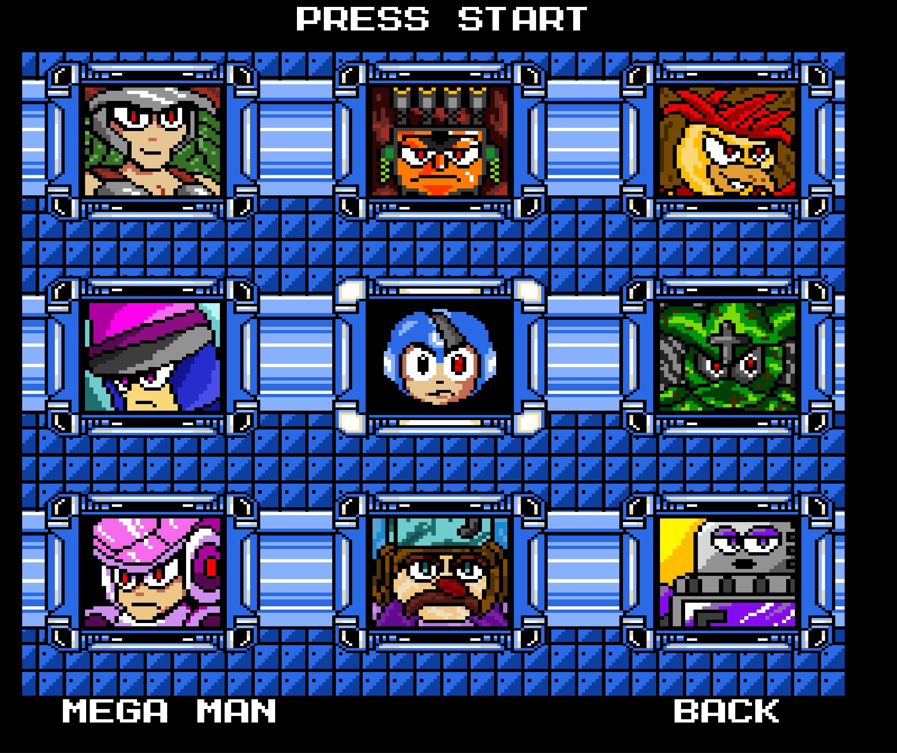

# MEGAMAN MAVERICK

## WORK IN PROGRESS

This game uses a mix of assets made my myself, Capcom, and fan artists. Currently, no credits have yet been given in 
the README or in-game. In the `assets` folder, you can find for some of the assets`.txt` files that contains links to 
the sources of assets. I will be adding comprehensive credits to the README and in-game credits soon.

## CREDITS

See the [credits](./assets/credits.txt) file for a list of artists and their work used in this game.

### TODO
- [ ] Give credit to myself, Capcom, and other artists for their work used in this game (music, sprites, etc.)
  - [ ] Create a credits screen
  - [ ] Thoroughly give credits to each artist and their work, provide links to their work
- [ ] Add steps to run game in README
  - [ ] Use `JPacker` to package assets into JAR so that game can be run without IDE or local JRE
  - [ ] Add instructions on how to run game locally for development
- [ ] Add explanation for the architecture of the game (so that others can learn to contribute if anyone wants to)
- [ ] Remove outdated bosses from boss select screen
- [ ] Complete the levels and bosses:
  - [ ] Moon Man level
  - [ ] Timber Woman level
  - [ ] Inferno Man level
  - [ ] Rodent Man level
  - [ ] Polarity Man level
  - [ ] Glow Man level
  - [ ] Naval Man level
  - [ ] Desert Man level
- [ ] Make extra (bonus) levels and bosses unlocked when the game is beaten"
  - [ ] Precious Man level
  - [ ] Cooler Woman level
  - [ ] Wreckage Man level
  - [ ] React Man level

## THE PROJECT

A simple fan game I'm working on in my spare time. Written in Kotlin using
my custom-made <a href="https://github.com/JohnLavender474/2D-Game-Engine">2D Game Engine</a> and built upon the
popular open-source game library <a href="https://libgdx.com/">LibGDX</a>.

This project was originally started in 2020 and written in Java. However, I was in school
at the time of committing to the project and have only worked on it in piecemeal since then.
Also, through the course of my studies and Summer 2023 internship experience, I became familiar
with Kotlin and good system design practices. Therefore, I started working on refactoring my code
to build the 2D Game Engine library which utilizes a lot of what I learned along the way and greatly
improves the code and design quality. After that, I commenced rewriting the game from Java into Kotlin
using the new library.

This game is in a very early stage and still has lots of more work to go before it is even in the alpha stage.
Nevertheless, I am very excited to continue working on it and see where it goes.

