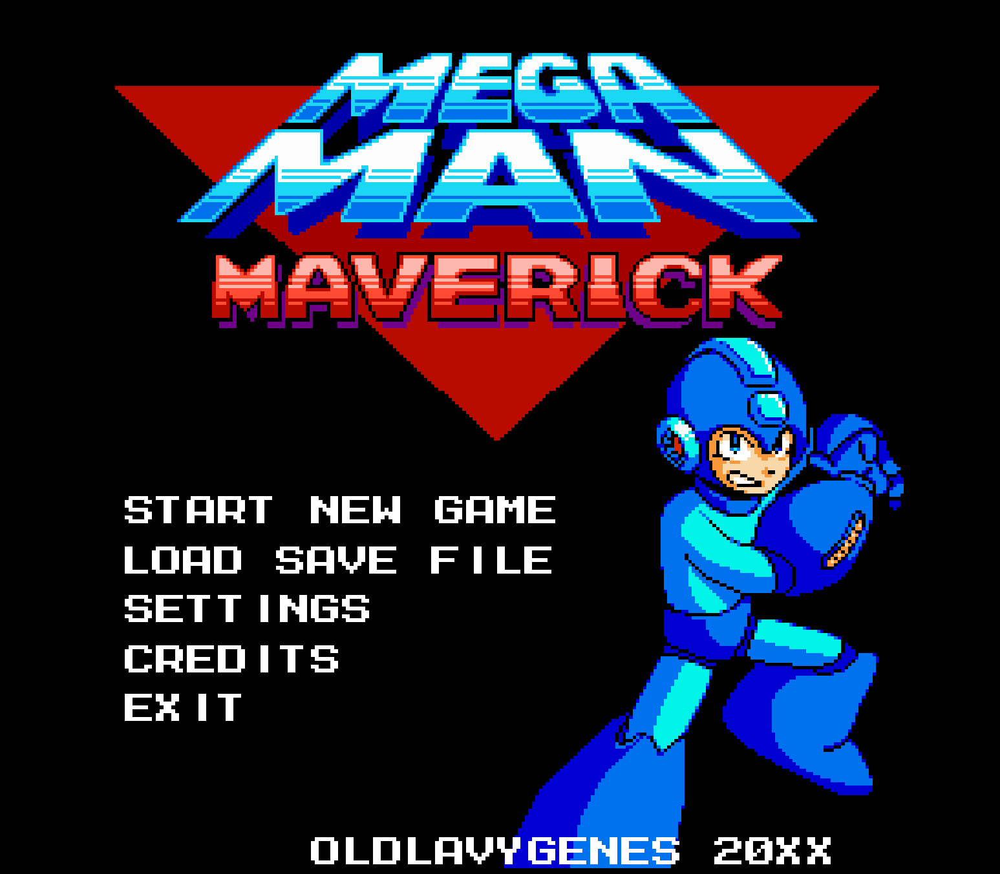

# MEGAMAN MAVERICK

---

**Megaman Maverick** is a fan game based on the [classic Megaman series by Capcom](https://megaman.fandom.com/wiki/Mega_Man_(original_series)).
All rights to the "Megaman" franchise are owned by Capcom. This game is developed solely for non-commercial purposes, 
in line with Capcom's lenient approach towards fan projects that do not seek to profit.

The game is currently under active development and is in a **pre-alpha** stage.

The game uses assets from the official Capcom games as well as from the community. See the [Credits](#Credits) section
below for attributions to the creators. Special thanks to these creators for helping to make my dream of creating
a Megaman game become a reality!

The game is built using the [Mega 2D Game Engine](https://github.com/JohnLavender474/Mega-2D-Game-Engine), an engine
built on top of the popular open-source [LibGDX game library](https://libgdx.com/). This game is programmed primarily in
Kotlin, with few parts written in Java.

View my YouTube channel for demos and more! https://youtube.com/playlist?list=PL4ZszXL-HC0r0E6Eb5NCFGhsi93AXoDZj&si=IITydzhhTSKmxc5-

---

## THE STORY

Written by _oldlavygenes_ (me) and _PJCosta5_

### Opening Text

    In the year 20XX…

    Three years have passed since the Roboenza Incident
    where a virus created at the hands of Dr. Wily
    caused robots to rise against humanity.

    The effects of that event are still felt in Mega City.
    The robot economy has been shattered, and so has 
    the trust between humans and robots.
    
    In an effort to prevent future robot uprisings, 
    the human government has imposed a new law: 
    robots are to be implanted with a security chip which
    will surveil their every action, thought, and emotion.

    Many robots, programmed for subservience, submit
    themselves to be implanted. However, not all go
    willingly. Some robots resist, but their efforts
    are futile, and their lives are decommissioned.

    Even Megaman, once hailed as the hero of the world,
    falls under scrutiny of the human government
    as many leaders and politicians demand that he
    too be subjected to the security chip implant.
    
    Dr. Light and Megaman stand before the parliament, 
    and in an exclamation of desperation pleas,
    "The robots must not be subjected to this impetuous
    dystopian madness! You must cease this at once!"

    His pleas, however, fall on deaf ears. A sudden vote
    is held to determine whether Dr. Light's robots
    should be exempt from the security chip implant.
    The majority vote against any form of exemption. 
    
    Suddenly, chaos ensues Mega City. A rogue faction 
    of robots calling themselves The Mavericks has
    risen in opposition of the laws to seize control.
    
    Mega Man rises and exclaims to the trembling
    parliament, "Don't worry, I'll stop these rogue
    robots and protect the people of Mega City!"

    Some of the politicians whose support of Megaman
    never once wavered begin to clap and cheer for him.
    Meanwhile, many others begin to wonder if the riot
    was planned all along by Megaman and Dr. Light as 
    a performative stunt to show how much the world
    needs Megaman in order to keep the peace.
    
    At once, Megaman jumps to the rescue, ready
    as ever to sacrifice himself for the greater
    good. But will it be enough? Or is this
    only the beginning of worse yet to come?

### Intro Stage: Mega City's Ruins

Objective: Save civilians, stop the Maverick attack, and gather intelligence on their leader.

Mega City is under siege. Robots rampage through the streets, structures burn, and humans flee in
terror. As Megaman arrives, he receives a communication from Dr. Light who explains the new power-ups
he's designed for Megaman: the air-dash and wall-jump moves. With these movesets, he says, Megaman will
be quicker and stronger than ever. Before ending the comm, Dr. Light says to Megaman, "Good luck, my son." 

Megaman pushes through waves of mad fighting robots, cars and structures on fire, and rubble.

At the end of the stage, Megaman is confronted by Dr. Wily who explains that he is the leader of this
impestuous riot. He exclaims to Megaman, "Ah, here he is, again. Megaman, the ultimate hero! Come to quell 
civil dissent among the populace, have we?"

Megaman shouts, "You call this civil! What are you up to, this time, Dr. Wily?!"

"Just showing these poor, dissatisfied, and belittled robots how to fight back against tyranny!"

Megaman replies back, "Dr. Wily, I'm starting to get really fed up with your antics! If I
can't keep you locked away in jail, then I guess I'll have to put you in the nursing home!"

"Gah! Hush your mouth, you little blue brat!" barks Wily. "We'll see who here is the real hero!"

The fight between Megaman and Dr. Wily ensues. Wily is soon defeated by Megaman, but he escapes 
Megaman's grasp. Before escaping, he says to Megaman, "Ha ha ha! You think you'll be remembered
as the hero for this? You'll see soon enough, Megaman! You'll rue the day you ever defied me!"

As Dr. Wily flies away in his saucer, a bird soars overhead and drops a white poop which splatters 
on his head. Wily's face is red and fuming as he vanishes into the distance.

The police robots arrive, and Megaman prepares to give a statement when all of a sudden, they shout at
him, "Remain where you are, Megaman! You're under arrest!" When Megaman asks for what, he gets this 
reply from the police captain, "You're under arrest for planning and organizing this riot. We know the 
truth, Megaman. You organized this riot so that you could "stop it" and display your so-called heroism 
to the whole world. We know you want to avoid the security chip law since you think you're so much 
better than everyone else, and we know you'd even go so far as to put others in harms way to do it!"

Megaman, shocked by the words he's hearing, can't find the words to say. All of a sudden, the police
captain gives a brazen command, "You know what, boys! To hell with our mandates! Let's shoot him!"

The police begin to fire on Megaman. Megaman is struck by a few bullets before Proto Man appears, 
using his shield to block the incoming bullets, though Proto Man himself is struck too by some of 
the bullets. He teleports the both of them out of Mega City to the temporary safety of Dr. Light's 
laboratory.

### Dr. Light’s Lab Cutscene

Dr. Light hastily repairs Mega Man as he knows there's little time before the authorities arrive. 
Proto Man, however, refuses help from Dr. Light, preferring to leave to repair himself 
on his own. 

Before leaving, Proto Man reveals that he's been tracking the Mavericks for a while and that their
goal is to rally as many robots as possible against the humans, radicalizing them and promising a 
society where robots will destroy the humans with government positions and rule over the ones who 
remain. 

Mega Man vows to stop the Mavericks and prove that coexistence between humans and robots is still 
possible.

Proto Man, as he leaves, shakes his head and whispers to himself, "Always the optimist, Mega..."

### Dr. Light’s Training Room

Dr. Light equips Mega Man equips Megaman with two new power-ups: the air-dash and wall-jump moves.

Once Megaman finishes his training session, he thanks Dr. Light for the upgrades and
start his main mission once again. 

Dr. Light warns Megaman, "Don't come back here, son. The authorities will surely capture you if you
do. Stay hidden, and stay safe. You were made to bring peace to this world. You can't fail."

"Don't worry, Dr. Light! I'll bring all this to a close soon enough! It's time for me to fight 
and save the world again!"

### Mid-Game Cutscene (after Megaman defeats two robot masters)

Roll calls Megaman to warn him that things are only getting worse. She transmits to him the following
televised news report on the Robot News channel:

"We come at you live from Mega City where it appears that Megaman is targeting and destroying 
peaceful robots across the world! Two high-profile robots have been slain. Who knows how much
more violence he plans to perpetuate. It appears that Dr. Wily is our only hope to bring peace
and protection to our kind."

Roll then changes the channel to the Human News channel where the following is reported:

"The evil Megaman strikes again! Our sources tell us that two high-profile robots, enlisted by the
government to bring the dangerous wily Megaman to justice, have been ruthlessly slain. What more
terror will the blue bomber bring to our world? Police have already captured his creator, Dr.
Light, and plan to interrogate him."

"I don't get it, Mega!" exclaims Roll. "Why are the stories being spun out of reality?! I'm scared,
Mega. I don't know how much longer I can hide before I'm caught and possbly decommissioned. I want
to help you."

"No, Roll. I know you're a strong fighting robot, too, but you need to stay out of this one. I don't
want to see you branded and tarnished like this, too."

"What will reputation matter when we're decommissioned, anyways, huh?!" Roll shouts back.

"Stay calm, Roll. I'll resolve this. I always do."

Megaman ends the communication, takes a heavy deep breath, and runs. 

### Final Stages: Wily's Fortress

Wily has taken over a sector of Mega City and built a fortress there. 

Mega Man infiltrates the fortress, battling advanced defenses.

At the end of the final stage, Megaman confronts Wily yet again.

TODO: dialogue here

Mega Man ultimately defeats Wily but not before the fortress begins to collapse in a 
self-destruct mode. A piece of rubble falls onto Megaman which pins him to the ground. 
Wily then runs away, leaving Megaman helpless within the collapsing fortress.

Suddenly, Proto Man appears, lifts the rubble off of Megaman, and teleports them both out 
(again) before the fortress entirely collapses.

They both teleport to a nearby cliff and watch as the fortress collapses and explodes.

### Ending Cutscene

Megaman's victory is bittersweet. Many humans rejoice in the defeat of Wily. Howver, many robots
who had been silently in agreement with Wily begin to voice their opinions against humanity's 
tyrannical new laws against them.

Seeing the divide grow ever wider between humans and robots, Megaman delivers a speech to the world.
"These events have shown us how far we've fallen. We cannot live in fear of each other. Robots and
humanity must live in peace. Each must learn to trust and strive to be trustworthy. If we do not act
as one, we will fall divided. Together, we can build a better future."

After the speech, Proto Man mockingly says, "Heh... You really think you can fix society with your
fluffy words and your Buster, Mega? Evil will always perpetuate itself. It's a never-ending cycle.
Face it, Megaman. You're a cog in the grand machine of chaos and corruption."

Megaman, aghast at Proto Man's remarks, exclaims, "Maybe I can't solve all the world's issues, but
I have to try! This is what I was made for, to bring peace and goodness to this world. It might be
vain and hopeless, but I'll never stop trying!"

Megaman marches off while Proto Man continues to stand there, his head slightly lowered and his mind
lost in reflection.

---

## CREDITS

The artwork, sounds, and music used in this game are sourced from Capcom and fan works from the community. Below is a
comprehensive listing of the credits for the artwork used in this game.

### Pixel Art

#### Megaman

- Megaman Redesigned - [SamuelX4](https://www.deviantart.com/samuelx4) 

#### Title Screen

- Megaman Title - [Mister Mike](https://www.spriters-resource.com/fullview/258/)
- Megaman Weapon Get Sprite - [PixelBoy127](https://www.spriters-resource.com/custom_edited/megamancustoms/sheet/166239/)

#### Megaman
- Megaman compiled spritesheet - [MetroidPeter](https://www.deviantart.com/metroidpeter/art/Compiled-Mega-Man-Sprite-Sheet-634443594) 
- Megaman airdash sprite - [IceLucario20XX](https://www.deviantart.com/icelucario20xx/art/Megaman-Dash-sprite-gb-to-nes-600445794)

#### Robot Masters

- Timber Woman spritesheet & mugshot- [oldlavygenes](https://www.deviantart.com/oldlavygenes474/art/TimberWoman-Megaman-Maverick-1087794591)
- Rodent Man spritesheet & mugshot - [oldlavygenes](https://www.deviantart.com/oldlavygenes474/art/Rodent-Man-Megaman-Maverick-1087797101)
- Precious Man spritesheet & mugshot - [oldlavygenes](https://www.deviantart.com/oldlavygenes474/art/Precious-Man-Megaman-Maverick-1087800596)
- Moon Man mugshot - [oldlavygenes](https://www.deviantart.com/oldlavygenes474/art/Moon-Man-Mugshot-Based-on-boberatu-s-sprite-1088201420)
- Moon Man spritesheet - [boberatu](https://www.deviantart.com/boberatu/art/MPN-006-Moon-Man-625679636) (edits and color pallette changes by oldlavygenes)
- Inferno Man spritesheet & mugshot - [boberatu](https://www.deviantart.com/boberatu/art/MPN-000-Volcano-Man-313694441)
- Reactor Man spritesheet & mugshot - [Balloon Cart](https://balloon-cart.itch.io/reactor-man-asset-pack)
- Glacier Man spritesheet & mugshot - [Balloon Cart](https://balloon-cart.itch.io/glacier-man-asset-pack)
- Desert Man spritesheet & mugshot - [rcrdcat](https://www.deviantart.com/rcrdcat/art/Desert-Man-Spritesheet-Mugshot-332165249) (minor edits by oldlavygenes)

#### Other Bosses
- Moon Head spritesheet - [oldlavygenes](https://www.deviantart.com/oldlavygenes474/art/MoonHead-Miniboss-Megaman-Maverick-1090151707)
- Nuclear Monkey spritesheet - [Balloon Cart](https://balloon-cart.itch.io/reactor-man-asset-pack)
- Bospider spritesheet - [Bean and Shawn](https://www.spriters-resource.com/game_boy_gbc/mmxtreme/sheet/480/?source=genre)
- Mecha Dragon spritesheet - [Mister Mike](https://www.spriters-resource.com/nes/mm2/sheet/2317/)
- Guts Tank spritesheet - [Mister Mike](https://www.spriters-resource.com/nes/mm2/sheet/2317/)
- Penpen Maker spritesheet - [Mister Mike](https://www.spriters-resource.com/nes/mm3/sheet/77911/) (currently not used)
- Sphinx spritesheet - [Mister Mike](https://www.spriters-resource.com/custom_edited/megamancustoms/sheet/108177/) (currently not used)

#### Enemies
- Sprites by [MegaRed225](https://www.deviantart.com/megared225/gallery):
  - [Random Enemies Set 4](https://www.deviantart.com/megared225/art/Random-Enemies-Set-4-517313170)
    - Demon Met
  - [Random Enemies Set 5](https://www.deviantart.com/megared225/art/Random-Enemies-Set-5-517418497):
    - Big Fish Neo
  - [Random Enemies Set 9](https://www.deviantart.com/megared225/art/Random-Enemy-Sprites-Set-9-557171615)
    - Fire Dispensenator
- All other enemy sprites sourced from https://www.spriters-resource.com/
/
#### Tilesets

- [Balloon Cart (Reactor Man)](https://balloon-cart.itch.io/reactor-man-asset-pack)
- [Balloon Cart (Glacier Man)](https://balloon-cart.itch.io/glacier-man-asset-pack)
- [MegaBot](https://ansimuz.itch.io/mega-bot)
- [Mega 8-Bit](https://assetstore.unity.com/packages/2d/environments/mega-8-bit-pixel-pack-60158?srsltid=AfmBOordeWICo0KR-N3MKcw6iqd2TehrlFgQn6Hijzmk09-2eoq2Gid0)
- Mister Mike:
  - [Megaman 6 - Tomahawk Man Tileset](https://www.spriters-resource.com/nes/mm6/sheet/16402/)
  - [Megaman 3 - Wily Stage 1 Tileset](https://www.spriters-resource.com/nes/mm3/sheet/16388/)
- AxeW1eld3r:
  - [Megaman 9 - Endless Attack Tileset](https://www.spriters-resource.com/wii/mm9/sheet/166545/)
- Rabbid4240:
  - [Megaman 9 - Magma Man Tileset](https://www.spriters-resource.com/wii/mm9/sheet/197901/)

### Music

- MMX6 Blaze Heatnix - [Famitard](https://youtu.be/QpbMwCnJDSo) - used in Inferno Man stage
- MMX5 Dark Necrobat - [Famitard](https://youtu.be/RosxPCxVOyk) - used in Moon Man stage
- MMX7 Vanish. Gung. - [Famitard](https://youtu.be/MFfZ-LEwcMo) - used in Desert Man stage
- MM8 Frost Man Alt - [Famitard](https://youtu.be/pQvwU4BavFI) - used in Glacier Man stage
- MMX8 Burn Rooster - [Famitard](https://youtu.be/DHh-QSWvb-o) - used in Reactor Man stage
- MMX6 Blaze Heatnix - [Famitard](https://youtu.be/QpbMwCnJDSo) - used in Inferno Man stage
- MM7 Slash Man - [Famitard](https://youtu.be/24ECwWnh6Es) - used in Rodent Man stage
- MMX6 Boss - [Famitard](https://youtu.be/IeySHEF5U_8) - used in Robot Master boss fights
- MMX6 Gate's Laboratory- [Famitard](https://youtu.be/Zdtp6f57E_c) - used in Wily stage 3
- MMX6 Sigma Final Boss - [Famitard](https://youtu.be/FVdYxfEo4lI) - used in Wily stage 3 boss fight
- MMX Vile Fight - [Famitard](https://youtu.be/iIcvnpYVTKc) - used in Wily stages 1 & 2 boss fights
- MMX5 Volt Kraken - [Famitard](https://www.youtube.com/watch?v=xi7Odov_rek&ab_channel=FamiTard) - not yet used
- MM7 Wily Boss - [MyNewSoundtrack](https://youtu.be/-CJlMksbypE) - not yet used
- TODO: Other music tracks are saved in the `assets` dir but not yet used in the game. These will be added here as they're added to the game.

### Sounds

- Megaman 5 Sounds: https://www.sounds-resource.com/nes/megaman5/sound/3618/
- Megaman 9 Sounds: https://www.sounds-resource.com/xbox_360/megaman9/sound/33185/

Sounds belong to Capcom (Megaman-ripped sound effects) and Nintendo (Mario-ripped sound effects)

TODO: add credits and links here for where the sounds were downloaded from

### Proof of Permissions for Fan Community Assets

For some of the fan artwork used in this game, the artist did not state in the work's description or elsewhere that the work was
free to use. For these works, I reached out to the artist personally to ask if I could use their work. Below are screenshots
as proof of permission. No proof is required for works where the description states that the asset is free to use.

Works by boberatu:

Works by rcrdcat:

Works by Famitard:

---

## RUNNING THE GAME

Currently, there is no "official" release of this game since it is still under active development. However, see the
section below on how to run the game using the source code.

### BUILDING THE GAME FROM SOURCE

Since the game runs using gradle and JRE, you can build a JAR of the game yourself. Keep in mind that in order to run
the generated JAR, you will need Java 17+ installed on your local machine.

#### Pre-requisites:

- git
- Java 17+

1. Use `git` to clone the project to a suitable location on your desktop.
2. From the root directory, run one of the following:

- Run using gradle:
    - Run the following command to start the desktop application: `./gradlew lwjgl:run`.
    - Optionally, you can run the `build-run-desktop-alpha.sh` or `build-run-desktop-debug.sh` script instead. The former is
      a shortcut for the above command. Meanwhile, the latter script includes configurable args for debugging purposes.
    - See the [GDX Liftoff](#GDX-Liftoff) section for more gradle commands.

---

## PLAYING THE GAME

### CONTROLS

By default, the keyboard controls for the game are the following whether the 1st value is the keyboard key and the 2nd
value is the "in-game" action:
- A: LEFT
- D: RIGHT
- S: DOWN
- W: UP
- J: B
- K: A
- ENTER: START

These can be remapped through the Keyboard Settings screen. Use the keys for "UP" and "DOWN" (by default the "W" and "S"
keys respectively) to navigate to the game button you wish to remap and press the key for "START" (by default the "ENTER"
key). You will be prompted to press any key on the keyboard to assign that key's code to the in-game button action.

The game supports controllers and should detect a controller as soon as it is plugged in. The keyboard controls continue
to work even when a controller is connected. The game has been tested with the following controllers:
- PS3 controller
- Xbox 360 controller
- NES-style USB controller

When a controller is connected, default mappings are assigned. Most likely, you will want to configure these mappings.
In the "Controller Settings" screen, you can reassign the mappings for the controller similarly to how the same is done
for the keyboard mappings.

### STARTING THE GAME (ALPHA)

This section pertains to starting an alpha build of the game (which can be started via the `./build-run-desktop-alpha.sh`
script), and it will be updated when beta and release versions are eventually released. To run an

When launching an alpha build, the first screen you see should be something like the following.

Press the key that corresponds to the command you wish to run. To quit the app, press the ESCAPE key.

If you press ENTER, you will be taken to the "Select Level" screen. Here, you can select any level you want to play.
Levels are separated into three categories:
- Beta: Levels that are over halfway complete but may require some level of redesigning
- Alpha: Levels that are less than halfway complete and require major redesigning
- Test: Levels that are made purely for testing game functionality, and that will not be included in release versions of the game

Navigate to the level you wish to play and press the key for START. This will launch the level. **NOTE: Due to the fact
that this game is an alpha, don't be surprised if the game crashes or if you encounter any bugs!**

To exit out of a level early, press the ESCAPE key. From the "Select Level" screen, you can return back to the start
screen by pressing the ESCAPE key.

---

## GDX Liftoff

This project was generated with a template including simple application launchers and an `ApplicationAdapter` extension that draws libGDX logo.

### Platforms

- `core`: Main module with the application logic shared by all platforms.
- `lwjgl3`: Primary desktop platform using LWJGL3; was called 'desktop' in older docs.

### Gradle

This project uses [Gradle](https://gradle.org/) to manage dependencies.
The Gradle wrapper was included, so you can run Gradle tasks using `gradlew.bat` or `./gradlew` commands.
Useful Gradle tasks and flags:

- `--continue`: when using this flag, errors will not stop the tasks from running.
- `--daemon`: thanks to this flag, Gradle daemon will be used to run chosen tasks.
- `--offline`: when using this flag, cached dependency archives will be used.
- `--refresh-dependencies`: this flag forces validation of all dependencies. Useful for snapshot versions.
- `build`: builds sources and archives of every project.
- `cleanEclipse`: removes Eclipse project data.
- `cleanIdea`: removes IntelliJ project data.
- `clean`: removes `build` folders, which store compiled classes and built archives.
- `eclipse`: generates Eclipse project data.
- `idea`: generates IntelliJ project data.
- `lwjgl3:jar`: builds application's runnable jar, which can be found at `lwjgl3/build/libs`.
- `lwjgl3:run`: starts the application.
- `test`: runs unit tests (if any).

Note that most tasks that are not specific to a single project can be run with `name:` prefix, where the `name` should 
be replaced with the ID of a specific project. For example, `core:clean` removes `build` folder only from the `core` 
project.
