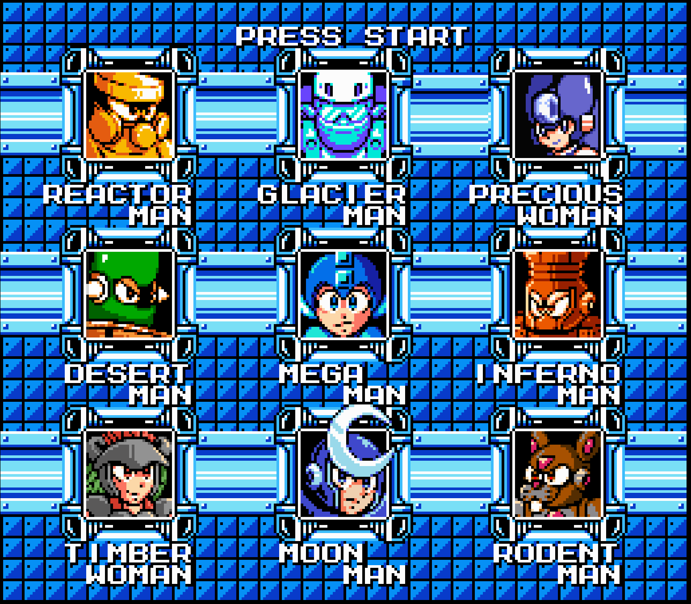

# MEGAMAN MAVERICK

---

**Megaman Maverick** is a fan game based on the [classic Megaman series by Capcom](https://megaman.fandom.com/wiki/Mega_Man_(original_series)).
All rights to the "Megaman" franchise are owned by Capcom. This game is developed solely for non-commercial purposes, 
in line with Capcom's lenient approach towards fan projects that do not seek to profit.

The game is currently under active development and is in a **pre-alpha** stage.

The game uses assets from the official Capcom games as well as from the community. See the [Credits](#Credits) section
below for attributions to the creators. Special thanks to these creators for helping to make my dream of creating
a Megaman game become a reality!

The game is built using the [Mega 2D Game Engine](https://github.com/JohnLavender474/Mega-2D-Game-Engine), an engine
built on top of the popular open-source [LibGDX game library](https://libgdx.com/). This game is programmed primarily in
Kotlin, with few parts written in Java.

View my YouTube channel for demos and more! https://youtube.com/playlist?list=PL4ZszXL-HC0r0E6Eb5NCFGhsi93AXoDZj&si=IITydzhhTSKmxc5-

---

## THE STORY

Written by _oldlavygenes_ (me) and _PJCosta5_

### Opening Text

    In the year 20XX…
    
    Robot uprisings have plagued humanity time and time again.
    
    To prevent future revolts, strict laws were enacted:
    all robots must be implanted with a security chip,
    monitoring their every action, thought, and emotion.
    
    While some robots comply, others resist — only to face decommissioning.
    Mega Man, once celebrated as a hero, now faces growing distrust.
    Many demand that even he and Dr. Light’s creations be subjected to the implant.
    
    Dr. Light pleads before the government, decrying the laws as oppressive and unjust.
    But his appeals are ignored, and a vote confirms no exemptions will be allowed.
    
    Suddenly, chaos engulfs Mega City. A rogue faction of robots, The Mavericks,
    rises in defiance of the new laws, threatening humanity's fragile order.
    
    As panic spreads, Mega Man vows to protect the city,
    but doubts linger — can he restore peace, or will his actions only deepen the divide?

### Intro Stage: Mega City's Ruins

Mega City is in chaos. Robots rampage through burning streets, humans flee in terror, and destruction spreads. 

As Mega Man arrives, Dr. Light communicates from the lab:

"Mega Man, I’ve upgraded your systems. You now have air-dash and wall-jump capabilities. Use them well.
Good luck, my son."

Mega Man fights his way through waves of rampaging robots, dodging collapsing buildings and navigating the chaos. 

At the end of the stage, he confronts a familiar figure — Dr. Wily, descending in his saucer with a smirk.

Dr. Wily: "Well, well! The ultimate hero has arrived to maintain order! Quelling dissent, are we?"

Mega Man: "Dissent? This is destruction! What are you planning, Wily?"

Dr. Wily: "I’m empowering those oppressed by your precious laws. Someone has to fight tyranny!"

Mega Man: "I’m done with your schemes, Wily! If jail doesn’t hold you, maybe the retirement home will!"

Dr. Wily: "Bah! Insolent blue brat! Let’s see who the real hero is!"

A battle ensues, and Wily is defeated. He flees after his defeat, escaping in his saucer. As he ascends, he sneers:

"You’ll see, Mega Man! Soon, they’ll turn on you. Mark my words!"

Before disappearing, a bird drops poop on Wily’s head, leaving him furious and fuming as he vanishes into the horizon.

As Mega Man prepares to report to the arriving police, they unexpectedly draw their weapons.

Police Captain: "Mega Man, you’re under arrest for organizing this riot! Your ‘heroics’ are a ploy to defy the 
security chip law. We know the truth — you’ll endanger lives just to protect yourself!"

Mega Man: "That’s ridiculous! I’d never—"

Police Captain: "Save it! Boys, take him down!"

The police open fire. Mega Man is hit twice before Proto Man appears and shields Megaman. He teleports them both to 
safety at Dr. Light’s lab, though he sustains a bullet to the arm himself.

### Dr. Light’s Lab Cutscene

Dr. Light hastily repairs Mega Man as he knows there's little time before the authorities arrive. 
Proto Man, however, refuses help from Dr. Light, preferring to leave to repair himself 
on his own. 

Before leaving, Proto Man reveals that he's been tracking the Mavericks for a while and that their
goal is to rally as many robots as possible against the humans, radicalizing them and promising a 
society where robots will destroy the humans with government positions and rule over the ones who 
remain. 

Mega Man vows to stop the Mavericks and prove that coexistence between humans and robots is still 
possible.

Proto Man, as he leaves, shakes his head and whispers to himself, "Always the optimist, Mega..."

Dr. Light warns Megaman, "Don't come back here, son. The authorities will surely capture you if you
do. Stay hidden, and stay safe. You were made to bring peace to this world. You can't fail."

"Don't worry, Dr. Light! I'll bring all this to a close soon enough! It's time for me to fight 
and save the world again!"

### Mid-Game Cutscene (after Megaman defeats two robot masters)

Roll contacts Mega Man, her voice trembling.

Roll: "Mega, things are getting worse. You need to see this."

She transmits a live broadcast from the Robot News Network:

Robot News Anchor: "Breaking news from Mega City: Reports claim Mega Man is hunting and destroying robots who oppose
the tyrannical laws imposed by the humans. Two high-profile robots — advocates for robot equality — have been slain. 
Who will he target next? Dr. Wily has vowed to protect robotkind and restore peace. Is he our only hope?"

Roll switches to the Human News Network:

Human News Anchor: "The rampage continues! Sources confirm Mega Man has destroyed two government-enlisted robots, loyal
to the humans and tasked with bringing him and the other rogue robots to justice. With Dr. Light in custody, authorities 
are confident they’ll uncover Mega Man’s plans. How much more terror will the blue bomber bring to our world?"

The screen fades, and Roll’s voice quivers.

Roll: "I don’t get it, Mega! Why are they twisting the truth like this? Their reports are contradictory and nothing but 
lies! I’m scared. They’re hunting us down. I don’t know how much longer I can stay hidden before they find me and shut 
me down. I want to help you!"

Mega Man: "No, Roll. You’re strong, I know, but you need to stay safe. I can’t let them drag your name through the mud 
like this."

Roll: "What’s the point of a reputation if we’re decommissioned anyway?!"

Mega Man: "I get it, Roll. But trust me — I’ll fix this. I always do."

He ends the transmission, takes a deep breath, and dashes off into the chaos.

### Final Stages: Wily's Fortress

Dr. Wily: "Ah, Mega Man! You’re like a bad penny — you should be brown instead of blue. Can’t you see? I’m fighting for 
robot freedom! You’re nothing but a pawn for those who fear and control the ultimate creations!"

Mega Man: "Don’t twist the truth, Wily! You’ve never cared about freedom for robots — you create and usethem for no 
other reason than to sow chaos and power! How many innocent robots have you manipulated for your schemes?"

Dr. Wily: "Innocent? Ha! There are no innocents left, Mega Man. Not you, not me. Only those strong enough to take their 
destiny into their own hands!"

Mega Man: "Then I’ll stop you, for everyone’s sake — human and robot alike!"

The battle ensues, with Mega Man ultimately defeating Wily. As sparks fly from Wily’s defeated machine, he cackles.

Dr. Wily: "You think you’ve won? You’re too late, Mega Man. My fortress is rigged to self-destruct! If I’m going down, 
you’re coming with me!"

The alarms blare, and the fortress begins to shake violently. A piece of rubble crashes onto Mega Man, pinning him to 
the ground.

Mega Man: "Wily! Stop this! You’ll destroy everything!"

Dr. Wily (fleeing): "Goodbye, Mega Man. Try not to get too comfortable under there! Ha ha ha!"

As Wily disappears into the distance, the fortress crumbles around Mega Man. Suddenly, Proto Man appears in a flash of 
light.

Proto Man: "Always getting yourself into trouble, huh? What would you do without me?"

Mega Man: "Proto Man! I... didn’t think you’d come."

Proto Man: "Let’s save the gratitude for later. Come on — we’ve got to move!"

Proto Man lifts the rubble off Mega Man and teleports them both to safety. From a nearby cliff, they watch the fortress 
collapse and explode in a fiery burst.

Mega Man (sighing): "Another one of Wily’s schemes, down the drain. But for how long?"

Proto Man: "He’ll be back, no doubt about it. Question is, will you be ready when he is?"

Mega Man: "I have to be. The world’s counting on me."

Proto Man gives a small smirk and vanishes into the distance, leaving Mega Man to watch the smoldering remains of 
Wily’s fortress.

### Ending Cutscene

Mega Man's victory is bittersweet. While many humans celebrate the defeat of Wily, the aftermath reveals deeper wounds. 
Robots who had quietly agreed with Wily's stance now openly voice their discontent with humanity's oppressive laws. 
The divide between humans and robots grows ever wider.

Amidst the tension, Mega Man addresses the world:

"These events have shown us how far we've fallen. Fear and distrust have driven us apart, but we must rise above it. 
Robots and humans can’t survive as enemies. We must learn to trust each other and prove ourselves worthy of that trust. 
Divided, we will destroy ourselves. Together, we can build a future where peace and understanding prevail."

As his speech concludes, Proto Man steps forward, his tone dripping with cynicism.

"Heh... You really think a speech and your Buster are enough to fix society, Mega? Evil isn't something you can beat; 
it’s a cycle that repeats, no matter what you do. Face it: you're just another cog in the machine of chaos and 
corruption."

Mega Man, taken aback but resolute, replies:

"Maybe you're right, Proto Man. Maybe I can’t fix everything. But that doesn’t mean I won’t try. I was created to bring 
peace and hope to this world. No matter how hopeless it seems, I’ll never stop fighting for what’s right."

Proto Man watches as Mega Man marches off, determination radiating from him. For a moment, Proto Man stands silent, his 
head lowered, lost in thought. Somewhere in his mind, a flicker of doubt wrestles with his cynicism, but he says nothing 
more as the shadows close around him.

---

## CREDITS

The artwork, sounds, and music used in this game are sourced from Capcom and fan works from the community. Below is a
comprehensive listing of the credits for the artwork used in this game.

### Pixel Art

#### Megaman

- Megaman Redesigned - [SamuelX4](https://www.deviantart.com/samuelx4) 

#### Title Screen

- Megaman Title - [Mister Mike](https://www.spriters-resource.com/fullview/258/)
- Megaman Weapon Get Sprite - [PixelBoy127](https://www.spriters-resource.com/custom_edited/megamancustoms/sheet/166239/)

#### Megaman
- Megaman compiled spritesheet - [MetroidPeter](https://www.deviantart.com/metroidpeter/art/Compiled-Mega-Man-Sprite-Sheet-634443594) 
- Megaman airdash sprite - [IceLucario20XX](https://www.deviantart.com/icelucario20xx/art/Megaman-Dash-sprite-gb-to-nes-600445794)

#### Robot Masters

- Timber Woman spritesheet & mugshot- [oldlavygenes](https://www.deviantart.com/oldlavygenes474/art/TimberWoman-Megaman-Maverick-1087794591)
- Rodent Man spritesheet & mugshot - [oldlavygenes](https://www.deviantart.com/oldlavygenes474/art/Rodent-Man-Megaman-Maverick-1087797101)
- Precious Man spritesheet & mugshot - [oldlavygenes](https://www.deviantart.com/oldlavygenes474/art/Precious-Man-Megaman-Maverick-1087800596)
- Moon Man mugshot - [oldlavygenes](https://www.deviantart.com/oldlavygenes474/art/Moon-Man-Mugshot-Based-on-boberatu-s-sprite-1088201420)
- Moon Man spritesheet - [boberatu](https://www.deviantart.com/boberatu/art/MPN-006-Moon-Man-625679636) (edits and color pallette changes by oldlavygenes)
- Inferno Man spritesheet & mugshot - [boberatu](https://www.deviantart.com/boberatu/art/MPN-000-Volcano-Man-313694441)
- Reactor Man spritesheet & mugshot - [Balloon Cart](https://balloon-cart.itch.io/reactor-man-asset-pack)
- Glacier Man spritesheet & mugshot - [Balloon Cart](https://balloon-cart.itch.io/glacier-man-asset-pack)
- Desert Man spritesheet & mugshot - [rcrdcat](https://www.deviantart.com/rcrdcat/art/Desert-Man-Spritesheet-Mugshot-332165249) (minor edits by oldlavygenes)

#### Other Bosses
- Moon Head spritesheet - [oldlavygenes](https://www.deviantart.com/oldlavygenes474/art/MoonHead-Miniboss-Megaman-Maverick-1090151707)
- Nuclear Monkey spritesheet - [Balloon Cart](https://balloon-cart.itch.io/reactor-man-asset-pack)
- Bospider spritesheet - [Bean and Shawn](https://www.spriters-resource.com/game_boy_gbc/mmxtreme/sheet/480/?source=genre)
- Mecha Dragon spritesheet - [Mister Mike](https://www.spriters-resource.com/nes/mm2/sheet/2317/)
- Guts Tank spritesheet - [Mister Mike](https://www.spriters-resource.com/nes/mm2/sheet/2317/)
- Penpen Maker spritesheet - [Mister Mike](https://www.spriters-resource.com/nes/mm3/sheet/77911/) (currently not used)
- Sphinx spritesheet - [Mister Mike](https://www.spriters-resource.com/custom_edited/megamancustoms/sheet/108177/) (currently not used)

#### Enemies
- Sprites by [MegaRed225](https://www.deviantart.com/megared225/gallery):
  - [Random Enemies Set 4](https://www.deviantart.com/megared225/art/Random-Enemies-Set-4-517313170)
    - Demon Met
  - [Random Enemies Set 5](https://www.deviantart.com/megared225/art/Random-Enemies-Set-5-517418497):
    - Big Fish Neo
  - [Random Enemies Set 9](https://www.deviantart.com/megared225/art/Random-Enemy-Sprites-Set-9-557171615)
    - Fire Dispensenator
- All other enemy sprites sourced from https://www.spriters-resource.com/
/
#### Tilesets

- [Balloon Cart (Reactor Man)](https://balloon-cart.itch.io/reactor-man-asset-pack)
- [Balloon Cart (Glacier Man)](https://balloon-cart.itch.io/glacier-man-asset-pack)
- [MegaBot](https://ansimuz.itch.io/mega-bot)
- [Mega 8-Bit](https://assetstore.unity.com/packages/2d/environments/mega-8-bit-pixel-pack-60158?srsltid=AfmBOordeWICo0KR-N3MKcw6iqd2TehrlFgQn6Hijzmk09-2eoq2Gid0)
- Mister Mike:
  - [Megaman 6 - Tomahawk Man Tileset](https://www.spriters-resource.com/nes/mm6/sheet/16402/)
  - [Megaman 3 - Wily Stage 1 Tileset](https://www.spriters-resource.com/nes/mm3/sheet/16388/)
- AxeW1eld3r:
  - [Megaman 9 - Endless Attack Tileset](https://www.spriters-resource.com/wii/mm9/sheet/166545/)
- Rabbid4240:
  - [Megaman 9 - Magma Man Tileset](https://www.spriters-resource.com/wii/mm9/sheet/197901/)

### Music

- MMX6 Blaze Heatnix - [Famitard](https://youtu.be/QpbMwCnJDSo) - used in Inferno Man stage
- MMX5 Dark Necrobat - [Famitard](https://youtu.be/RosxPCxVOyk) - used in Moon Man stage
- MMX7 Vanish. Gung. - [Famitard](https://youtu.be/MFfZ-LEwcMo) - used in Desert Man stage
- MM8 Frost Man Alt - [Famitard](https://youtu.be/pQvwU4BavFI) - used in Glacier Man stage
- MMX8 Burn Rooster - [Famitard](https://youtu.be/DHh-QSWvb-o) - used in Reactor Man stage
- MMX6 Blaze Heatnix - [Famitard](https://youtu.be/QpbMwCnJDSo) - used in Inferno Man stage
- MM7 Slash Man - [Famitard](https://youtu.be/24ECwWnh6Es) - used in Rodent Man stage
- MMX6 Boss - [Famitard](https://youtu.be/IeySHEF5U_8) - used in Robot Master boss fights
- MMX6 Gate's Laboratory- [Famitard](https://youtu.be/Zdtp6f57E_c) - used in Wily stage 3
- MMX6 Sigma Final Boss - [Famitard](https://youtu.be/FVdYxfEo4lI) - used in Wily stage 3 boss fight
- MMX Vile Fight - [Famitard](https://youtu.be/iIcvnpYVTKc) - used in Wily stages 1 & 2 boss fights
- MMX5 Volt Kraken - [Famitard](https://www.youtube.com/watch?v=xi7Odov_rek&ab_channel=FamiTard) - not yet used
- MM7 Wily Boss - [MyNewSoundtrack](https://youtu.be/-CJlMksbypE) - not yet used
- TODO: Other music tracks are saved in the `assets` dir but not yet used in the game. These will be added here as they're added to the game.

### Sounds

- Megaman 5 Sounds: https://www.sounds-resource.com/nes/megaman5/sound/3618/
- Megaman 9 Sounds: https://www.sounds-resource.com/xbox_360/megaman9/sound/33185/

Sounds belong to Capcom (Megaman-ripped sound effects) and Nintendo (Mario-ripped sound effects)

TODO: add credits and links here for where the sounds were downloaded from

### Proof of Permissions for Fan Community Assets

For some of the fan artwork used in this game, the artist did not state in the work's description or elsewhere that the work was
free to use. For these works, I reached out to the artist personally to ask if I could use their work. Below are screenshots
as proof of permission. No proof is required for works where the description states that the asset is free to use.

Works by boberatu:

Works by rcrdcat:

Works by Famitard:

---

## RUNNING THE GAME

Currently, there is no "official" release of this game since it is still under active development. However, see the
section below on how to run the game using the source code.

### BUILDING THE GAME FROM SOURCE

Since the game runs using gradle and JRE, you can build a JAR of the game yourself. Keep in mind that in order to run
the generated JAR, you will need Java 17+ installed on your local machine.

#### Pre-requisites:

- git
- Java 17+

1. Use `git` to clone the project to a suitable location on your desktop.
2. From the root directory, run one of the following:

- Run using gradle:
    - Run the following command to start the desktop application: `./gradlew lwjgl:run`.
    - Optionally, you can run the `build-run-desktop-alpha.sh` or `build-run-desktop-debug.sh` script instead. The former is
      a shortcut for the above command. Meanwhile, the latter script includes configurable args for debugging purposes.
    - See the [GDX Liftoff](#GDX-Liftoff) section for more gradle commands.

---

## PLAYING THE GAME

### CONTROLS

By default, the keyboard controls for the game are the following whether the 1st value is the keyboard key and the 2nd
value is the "in-game" action:
- A: LEFT
- D: RIGHT
- S: DOWN
- W: UP
- J: B
- K: A
- ENTER: START

These can be remapped through the Keyboard Settings screen. Use the keys for "UP" and "DOWN" (by default the "W" and "S"
keys respectively) to navigate to the game button you wish to remap and press the key for "START" (by default the "ENTER"
key). You will be prompted to press any key on the keyboard to assign that key's code to the in-game button action.

The game supports controllers and should detect a controller as soon as it is plugged in. The keyboard controls continue
to work even when a controller is connected. The game has been tested with the following controllers:
- PS3 controller
- Xbox 360 controller
- NES-style USB controller

When a controller is connected, default mappings are assigned. Most likely, you will want to configure these mappings.
In the "Controller Settings" screen, you can reassign the mappings for the controller similarly to how the same is done
for the keyboard mappings.

### STARTING THE GAME (ALPHA)

This section pertains to starting an alpha build of the game (which can be started via the `./build-run-desktop-alpha.sh`
script), and it will be updated when beta and release versions are eventually released. To run an

When launching an alpha build, the first screen you see should be something like the following.

Press the key that corresponds to the command you wish to run. To quit the app, press the ESCAPE key.

If you press ENTER, you will be taken to the "Select Level" screen. Here, you can select any level you want to play.
Levels are separated into three categories:
- Beta: Levels that are over halfway complete but may require some level of redesigning
- Alpha: Levels that are less than halfway complete and require major redesigning
- Test: Levels that are made purely for testing game functionality, and that will not be included in release versions of the game

Navigate to the level you wish to play and press the key for START. This will launch the level. **NOTE: Due to the fact
that this game is an alpha, don't be surprised if the game crashes or if you encounter any bugs!**

To exit out of a level early, press the ESCAPE key. From the "Select Level" screen, you can return back to the start
screen by pressing the ESCAPE key.

---

## GDX Liftoff

This project was generated with a template including simple application launchers and an `ApplicationAdapter` extension that draws libGDX logo.

### Platforms

- `core`: Main module with the application logic shared by all platforms.
- `lwjgl3`: Primary desktop platform using LWJGL3; was called 'desktop' in older docs.

### Gradle

This project uses [Gradle](https://gradle.org/) to manage dependencies.
The Gradle wrapper was included, so you can run Gradle tasks using `gradlew.bat` or `./gradlew` commands.
Useful Gradle tasks and flags:

- `--continue`: when using this flag, errors will not stop the tasks from running.
- `--daemon`: thanks to this flag, Gradle daemon will be used to run chosen tasks.
- `--offline`: when using this flag, cached dependency archives will be used.
- `--refresh-dependencies`: this flag forces validation of all dependencies. Useful for snapshot versions.
- `build`: builds sources and archives of every project.
- `cleanEclipse`: removes Eclipse project data.
- `cleanIdea`: removes IntelliJ project data.
- `clean`: removes `build` folders, which store compiled classes and built archives.
- `eclipse`: generates Eclipse project data.
- `idea`: generates IntelliJ project data.
- `lwjgl3:jar`: builds application's runnable jar, which can be found at `lwjgl3/build/libs`.
- `lwjgl3:run`: starts the application.
- `test`: runs unit tests (if any).

Note that most tasks that are not specific to a single project can be run with `name:` prefix, where the `name` should 
be replaced with the ID of a specific project. For example, `core:clean` removes `build` folder only from the `core` 
project.
